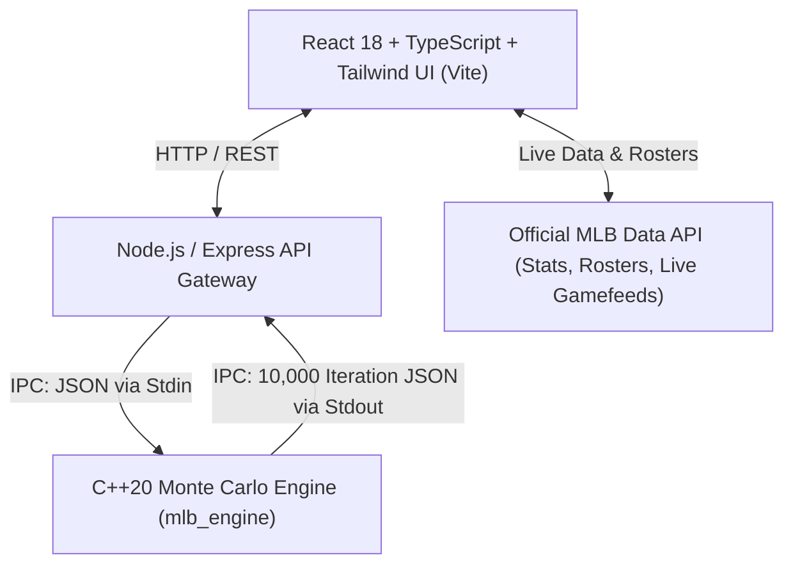

# ⚾ MLB Match Prediction & Sabermetric Analytics Platform

A high-performance, full-stack baseball analytics and match prediction platform powered by live MLB Data APIs and an ultra-fast **C++20 Object-Oriented Sabermetric & Monte Carlo Simulation Engine**.


---

## 📑 Table of Contents

- [Overview](#-overview)
- [System Architecture](#-system-architecture)
- [Key Features](#-key-features)
- [Technology Stack](#-technology-stack)
- [Project Structure](#-project-structure)
- [Simulation & Sabermetric Core (C++20)](#-simulation--sabermetric-core-c20)
- [Getting Started](#-getting-started)
  - [Prerequisites](#prerequisites)
  - [1. Clone and Install Dependencies](#1-clone-and-install-dependencies)
  - [2. Compile the C++ Simulation Engine](#2-compile-the-c-simulation-engine)
  - [3. Start Backend Bridge API](#3-start-backend-bridge-api)
  - [4. Start Frontend Client](#4-start-frontend-client)
  - [Quick Run (Windows Batch)](#quick-run-windows)
- [Docker & Production Deployment](#-docker--production-deployment)
- [API Endpoints](#-api-endpoints)
- [Environment Configuration](#-environment-configuration)

---

## 🌟 Overview

This application bridges modern web technologies with high-performance systems programming to deliver professional-grade baseball analytics and probabilistic match forecasting. 

Unlike traditional heuristic models, the prediction system runs **10,000 Monte Carlo Markov Chain simulations** per matchup through an optimized C++20 core, evaluating individual batter-vs-pitcher matchups, platoon splits, ballpark factors, base-state transition probabilities, and bullpen dynamics in milliseconds.

---

## 🏗 System Architecture



- **Frontend Client**: Interactive UI with responsive cards, live baseball diamond visualizer, in-game match predictions, standings, and player comparison charts.
- **Backend Bridge API**: Express.js microservice handling child process IPC execution of the compiled C++ binary and CORS proxying.
- **Core Engine**: Standalone native binary written in C++20 with zero external dependencies, utilizing STL algorithms and high-speed random distributions for Monte Carlo simulations.

---

## 🚀 Key Features

### 1. 🔴 Live Game Center & In-Game Prediction
- **Live Interactive Diamond Tracker**: Real-time visualization of base runners (1st, 2nd, 3rd), outs, count (balls/strikes), and current batter/pitcher.
- **Real-Time Linescore & Play-by-Play**: Full inning-by-inning scoreboard with live pitch and play description feeds.
- **Live Win Probability & In-Game Betting Intelligence**: Dynamic recalculation of win probabilities, projected run totals, handicap / spread coverage, and leverage index based on live game states and C++20 Monte Carlo simulations.
- **Boxscore Matrix**: Live in-game hitting and pitching boxscores for active games.

### 2. 📊 Team Stats & Standings
- Real-time American League & National League standings (East, Central, West divisions + Wild Card races).
- Complete record breakdowns: Wins, Losses, PCT, Games Back (GB), Runs Scored (RS), Runs Allowed (RA), Run Differential (DIFF), Home/Away splits, Streak, and L10.

### 3. ⚾ Player Database & Analytics
- Searchable player database across all 30 MLB active 40-man rosters.
- Toggle between **Hitting Stats** (AVG, OBP, SLG, OPS, HR, RBI, H, 2B, 3B, BB, SO, SB) and **Pitching Stats** (ERA, WHIP, W-L, K/9, BB/9, HR/9, IP, SO, SV).

### 4. 🏆 League Leaders
- Real-time Top 10 MLB leaders across hitting (AVG, HR, RBI, OPS, Hits) and pitching categories (ERA, Strikeouts, Wins, WHIP).

---

## 🛠 Technology Stack

| Layer | Technologies | Description |
|---|---|---|
| **Frontend UI** | React 18, TypeScript, Vite, Tailwind CSS, Lucide React, CLSX | Reactive modern UI with high-contrast sports analytics design |
| **Backend API** | Node.js, Express.js, CORS | REST API bridge & IPC child process manager |
| **Prediction Engine** | C++20, GCC / Clang / MSVC (`-O3` optimized) | Object-Oriented Sabermetric calculator & Monte Carlo simulator |
| **Data Provider** | Official MLB Stats API (`statsapi.mlb.com`) | Real-time schedules, live game data, player stats & team standings |
| **Deployment / DevOps**| Docker (Multi-stage), Render, Vercel | Containerized backend + static CDN frontend |

---

## 📁 Project Structure

```
MLBPrediction/
├── engine/                       # C++20 Simulation Core
│   ├── include/                  # C++ Header Files
│   │   ├── Batter.hpp            # Batter stats & platoon calculations
│   │   ├── Lineup.hpp            # 9-man batting order structure
│   │   ├── MatchSimulator.hpp    # Monte Carlo simulation logic
│   │   ├── Pitcher.hpp           # Pitcher attributes & stamina
│   │   ├── Player.hpp            # Base player OOP class
│   │   ├── PredictionResult.hpp  # Simulation results & odds computation
│   │   ├── SabermetricCalculator.hpp # BaseRuns, Pythagenpat, Log5 formulas
│   │   └── Team.hpp              # Team model with park factors
│   ├── src/                      # C++ Implementation Files
│   │   ├── Batter.cpp
│   │   ├── Lineup.cpp
│   │   ├── MatchSimulator.cpp
│   │   ├── Pitcher.cpp
│   │   ├── Player.cpp
│   │   ├── PredictionResult.cpp
│   │   ├── SabermetricCalculator.cpp
│   │   ├── Team.cpp
│   │   └── main.cpp              # CLI / JSON Stdin-Stdout entrypoint
│   ├── Makefile                  # Linux/macOS build configuration
│   ├── build.bat                 # Windows build script
│   └── build.sh                  # Linux build script
│
├── server/                       # Node.js Express API
│   └── server.js                 # Bridge server, IPC runner & NLP parser
│
├── src/                          # React + TypeScript Frontend
│   ├── components/               # UI Components
│   │   ├── live/                 # Live In-Game Tracker components
│   │   │   ├── LiveBettingPredictionCard.tsx
│   │   │   ├── LiveDiamondTracker.tsx
│   │   │   ├── LiveLinescoreTable.tsx
│   │   │   ├── LivePlayByPlayFeed.tsx
│   │   │   ├── LivePlayerBoxscore.tsx
│   │   │   ├── LiveScoreboardCard.tsx
│   │   │   └── LiveWinProbabilityCard.tsx
│   │   ├── LeadersTab.tsx        # League leaders tab
│   │   ├── LiveGamesTab.tsx      # Today's live game center
│   │   ├── Navbar.tsx            # Navigation bar
│   │   ├── PlayerSelectCard.tsx  # Dropdown player selector
│   │   ├── PlayerStatsTab.tsx    # Player search & database
│   │   ├── PredictionResults.tsx # Prediction display card
│   │   ├── PredictionTab.tsx     # Match setup & lineup builder
│   │   ├── RawLineupModal.tsx    # Text lineup importer modal
│   │   └── TeamStatsTab.tsx      # MLB Standings & stats
│   ├── services/                 # API & Data Integration
│   │   ├── liveGameApi.ts        # MLB Live feed service
│   │   ├── mlbApi.ts             # MLB Stats API wrapper
│   │   ├── predictionApi.ts      # Bridge API client
│   │   └── sharpApi.ts           # Advanced analytical models
│   ├── types/                    # TypeScript Type Definitions
│   ├── utils/                    # Helper functions & park factors
│   ├── App.tsx                   # Root React component
│   └── main.tsx                  # Client entry point
│
├── Dockerfile                    # Multi-stage Dockerfile for containerized deployment
├── render.yaml                   # Render.com Blueprint configuration
├── vercel.json                   # Vercel SPA routing configuration
├── run_app.bat                   # Windows 1-click startup batch script
├── package.json                  # NPM dependencies and scripts
└── README.md                     # Project documentation
```

---

## 🧮 Simulation & Sabermetric Core (C++20)

The engine models a full 9-inning game at the plate-appearance level using established sabermetric principles:

1. **Platoon Advantage**: Adjusts batter and pitcher metrics based on handedness (L vs R, R vs R, etc.).
2. **BaseRuns & Linear Weights**: Estimates expected run creation per plate appearance based on walk rate, strikeout rate, and ISO power.
3. **Park Factors**: Scales run scoring and home run probabilities to the specific ballpark environment.
4. **Markov Base-Out States**: Simulates base runner advancement (24 base-out states: 8 base configurations $\times$ 3 out states).
5. **Monte Carlo Execution**: 10,000 independent match iterations generate normal and extreme distribution outcomes to compute fair market probabilities.

---

## ⚡ Getting Started

### Prerequisites
- **Node.js** (v18.0.0 or later) & **npm**
- **C++ Compiler** with **C++20** support (`g++` / MinGW-w64 on Windows, `g++` / `clang++` on Linux/macOS)

---

### 1. Clone and Install Dependencies

```bash
git clone https://github.com/itsCheeto2K/mlb-prediction.git
cd mlb-prediction
npm install
```

---

### 2. Compile the C++ Simulation Engine

#### On Windows (MinGW / GCC):
```cmd
g++ -std=c++20 -O3 -Iengine/include engine/src/*.cpp -o mlb_engine.exe
```
*Or run `engine\build.bat`.*

#### On Linux / macOS:
```bash
g++ -std=c++20 -O3 -Iengine/include engine/src/*.cpp -o mlb_engine
chmod +x mlb_engine
```
*Or run `make -C engine` or `bash engine/build.sh`.*

---

### 3. Start Backend Bridge API

```bash
npm run server
```
The bridge API starts at `http://localhost:3001`.

---

### 4. Start Frontend Client

In a separate terminal:
```bash
npm run dev
```
Open your browser and navigate to `http://localhost:5173`.

---

### 🚀 Quick Run (Windows)
You can launch both the backend server and frontend development server simultaneously with one click:
```cmd
run_app.bat
```

---

## 🐳 Docker & Production Deployment

### Multi-stage Docker Build
The provided `Dockerfile` compiles the C++20 engine inside a Debian environment with `g++` and packages the Node.js Express server:

```bash
# Build the Docker container
docker build -t mlb-prediction-backend .

# Run the container
docker run -p 3001:3001 mlb-prediction-backend
```

### Hosting Deployments
- **Backend**: Pre-configured for [Render](https://render.com) using `render.yaml` with automated C++ compilation in Docker.
- **Frontend**: Pre-configured for [Vercel](https://vercel.com) using `vercel.json` for SPA routing.

---

## 🔌 API Endpoints

| Method | Endpoint | Description |
|---|---|---|
| `GET` | `/api/health` | Service health check and C++ binary status verification |
| `POST` | `/api/predict` | Executes 10,000 Monte Carlo simulation runs given matchup JSON payload |
| `POST` | `/api/parse-raw-lineup` | Parses raw lineup text into structured team, pitcher, and batter JSON |

---

## ⚙️ Environment Configuration

Create a `.env` file in the root directory (refer to `.env.example`):

```env
PORT=3001
VITE_API_URL=http://localhost:3001
```

---

## 📜 License

This project is licensed under the MIT License - see the LICENSE file for details.
